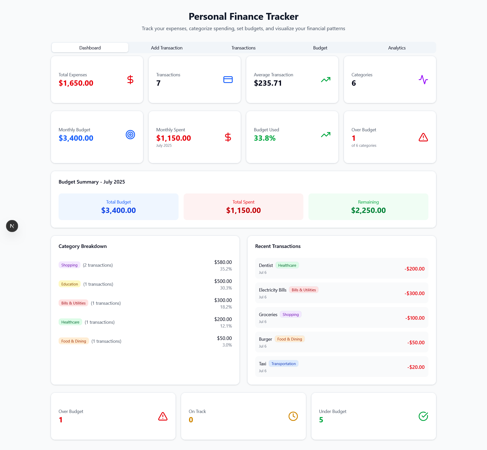
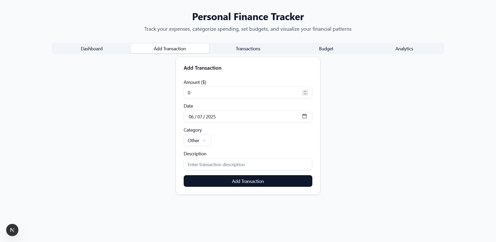
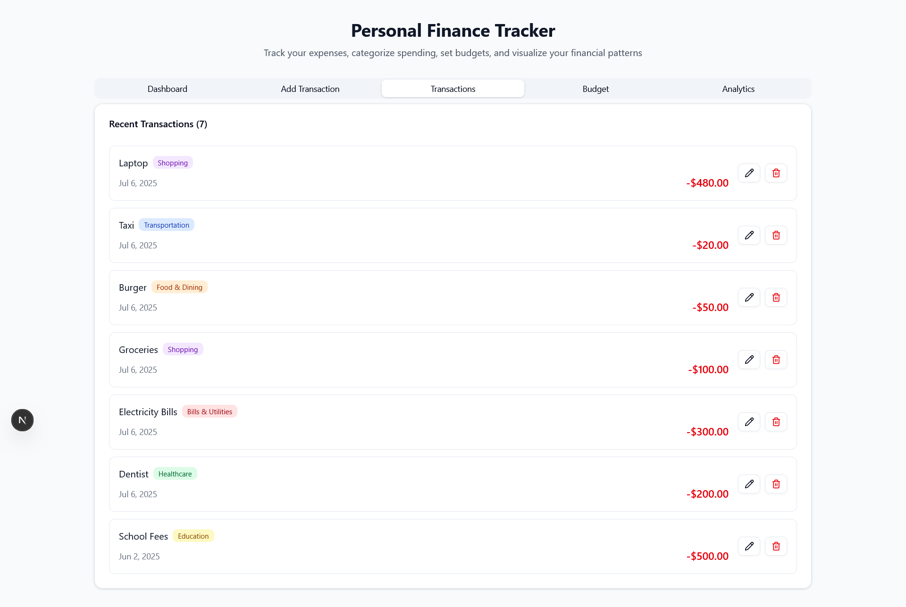
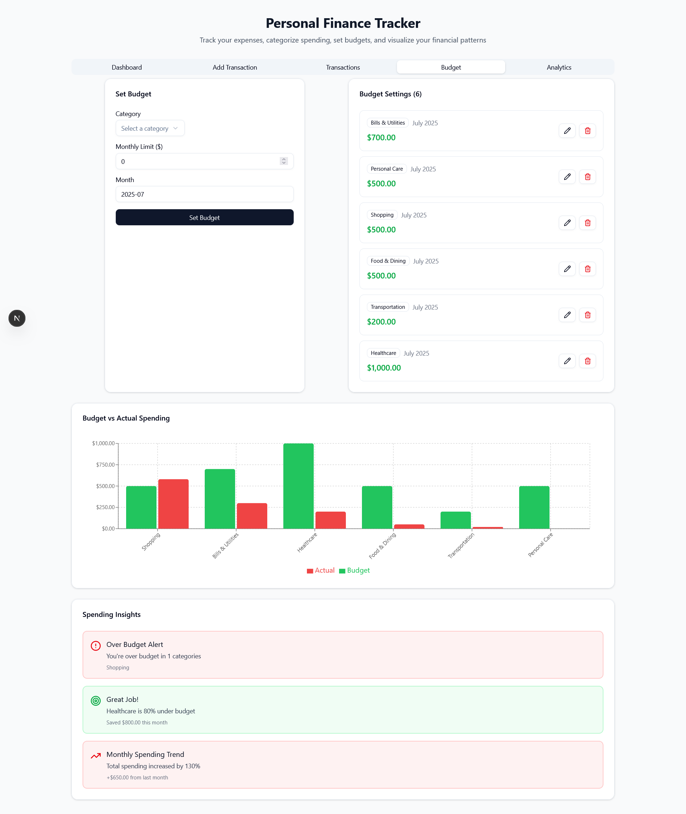
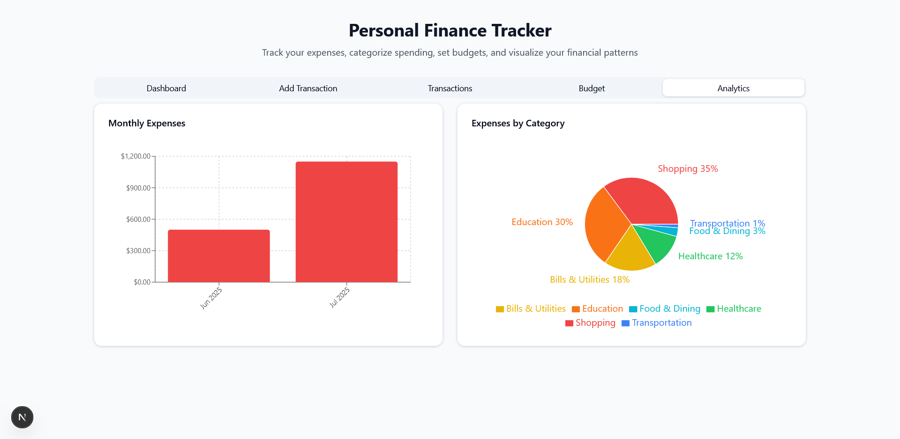

# Personal Finance Tracker 💰

A comprehensive, full-stack web application for tracking personal expenses, setting budgets, and visualizing financial patterns. Built with Next.js, TypeScript, MongoDB, and modern UI components.



## 🚀 Features

### Stage 1: Transaction Management
- ✅ Add, edit, and delete transactions
- ✅ Form validation and error handling
- ✅ Monthly expenses visualization with interactive charts
- ✅ Responsive design for all devices

### Stage 2: Category Management & Dashboard
- ✅ Predefined expense categories (Food, Transport, Entertainment, Bills, etc.)
- ✅ Category-wise spending visualization with pie charts
- ✅ Comprehensive dashboard with summary cards
- ✅ Recent transactions overview

### Stage 3: Budget Management & Insights
- ✅ Set monthly budgets for different categories
- ✅ Budget vs actual spending comparison charts
- ✅ Spending insights and financial analytics
- ✅ Budget status indicators and alerts

## 🛠️ Tech Stack

- **Frontend**: Next.js 14, React 18, TypeScript
- **Backend**: Next.js API Routes, MongoDB with Mongoose
- **UI Components**: shadcn/ui, Radix UI, Tailwind CSS
- **Charts**: Recharts
- **Notifications**: Sonner Toast
- **Icons**: Lucide React

## 📋 Prerequisites

Before running this project, make sure you have:

- Node.js (v18 or higher)
- npm or yarn
- MongoDB database (local or cloud instance)

## ⚡ Quick Start

1. **Clone the repository**
   ```bash
   git clone https://github.com/yourusername/personal-finance-tracker.git
   cd personal-finance-tracker
   ```

2. **Install dependencies**
   ```bash
   npm install
   # or
   yarn install
   ```

3. **Set up environment variables**
   
   Create a `.env.local` file in the root directory:
   ```env
   MONGODB_URI=your_mongodb_connection_string
   ```

4. **Run the development server**
   ```bash
   npm run dev
   # or
   yarn dev
   ```

5. **Open your browser**
   
   Navigate to [http://localhost:3000](http://localhost:3000)

## 🏗️ Project Structure

```
src/
├── app/
│   ├── api/
│   │   ├── budgets/
│   │   │   ├── route.ts
│   │   │   └── [id]/
│   │   │       └── route.ts
│   │   └── transactions/
│   │       ├── route.ts
│   │       └── [id]/
│   │           └── route.ts
│   ├── globals.css
│   ├── layout.tsx
│   └── page.tsx
├── components/
│   ├── ui/                    # shadcn/ui components
│   ├── BudgetComparisonChart.tsx
│   ├── BudgetForm.tsx
│   ├── BudgetList.tsx
│   ├── BudgetStatusCards.tsx
│   ├── CategoryPieChart.tsx
│   ├── Dashboard.tsx
│   ├── ErrorBoundary.tsx
│   ├── MonthlyChart.tsx
│   ├── SpendingInsights.tsx
│   ├── TransactionForm.tsx
│   └── TransactionList.tsx
├── lib/
│   ├── mongodb.ts
│   └── utils.ts
├── models/
│   ├── Budget.ts
│   └── Transaction.ts
├── types/
│   ├── constants.ts
│   └── global.d.ts
└── scripts/
    └── migrate-categories.js
```

## 🎯 API Endpoints

### Transactions
- `GET /api/transactions` - Get all transactions
- `POST /api/transactions` - Create new transaction
- `PUT /api/transactions/[id]` - Update transaction
- `DELETE /api/transactions/[id]` - Delete transaction

### Budgets
- `GET /api/budgets` - Get all budgets
- `POST /api/budgets` - Create new budget
- `PUT /api/budgets/[id]` - Update budget
- `DELETE /api/budgets/[id]` - Delete budget

## 📊 Screenshots

### Dashboard


### Add Transaction


### Transactions List


### Budget Management


### Analytics


## 🔧 Configuration

### Environment Variables

| Variable | Description | Required |
|----------|-------------|----------|
| `MONGODB_URI` | MongoDB connection string | Yes |

### Predefined Categories

The application comes with predefined expense categories:
- Food & Dining
- Transportation
- Entertainment
- Utilities & Bills
- Shopping
- Healthcare
- Education
- Travel
- Other

## 🚀 Deployment

### Vercel (Recommended)

1. Push your code to GitHub
2. Connect your repository to Vercel
3. Add environment variables in Vercel dashboard
4. Deploy automatically

### Manual Deployment

1. **Build the application**
   ```bash
   npm run build
   ```

2. **Start the production server**
   ```bash
   npm start
   ```


---

<div align="center">
  <strong>Built with ❤️ using Next.js and TypeScript</strong>
</div>